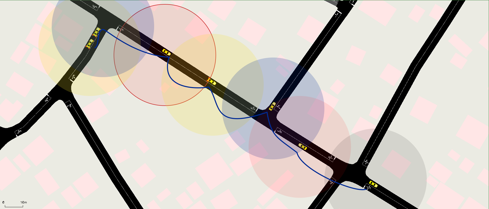
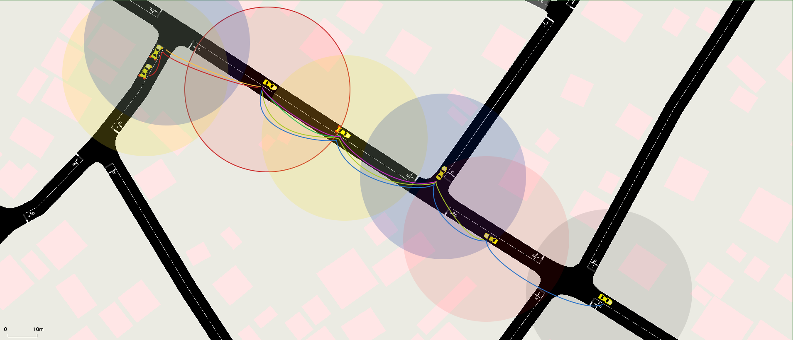

# **Omniscient**


Um simulador de VANETs (Vehicular Ad-hoc Network) baseado na arquitectura IEEE WAVE com foco o tratamento dos pacotes trocados entre os diferentes veículos na rede.

## Protocolo

O procolo de controle de tráfego rodoviário do omniscent é denominado **RESF-ROAD-STATE**, que consiste no envio de mensagens de solicitação de estado à todos os veículos que se encontram na mesma via que o veículo solicitador. Obedecendo ao seguinte fluxo:

1. O veículo solicitador transmite uma mensagem de solicitação de estado rodoviário a todos os veículos presentes na mesma via.

   

   Um pacote do tipo **CHECK-STATUS** é transmitido para todas as estações ou veículos vizinhos da estação solicitadora, com a finalidade de verificar o estado da via rodoviária. Quando uma estação recebe a solicitação, ela realiza o encaminhamento (roteamento) da mesma para outras estações dentro de seu alcance de transmissão.

2. Os veículos receptores, após receberem a solicitação, respondem com uma mensagem contendo informações sobre o seu estado actual, como velocidade, localização, entre outros dados relevantes.

   

   Cada estação ou veículo que recebe o pacote **CHECK-STATUS** responde de maneira individual à estação solicitadora com um pacote STATUS, fornecendo informações sobre seu estado actual, como velocidade, localização, condições de tráfego nas proximidades e quaisquer outros dados relevantes.

3. O veículo solicitador recebe as respostas dos demais veículos e processa as informações recebidas, construindo assim um panorama geral do estado rodoviário na via em questão.

Este protocolo permite que os veículos obtenham informações actualizadas sobre as condições de tráfego em tempo real, facilitando a tomada de decisões e o planeamento de rotas mais eficientes, contribuindo para a segurança e fluidez do tráfego rodoviário.

## Build do simulador

```bash
    sudo apt install sumo sumo-gui
    mkdir build && cd build
    cmake .. && cmake --build .
```